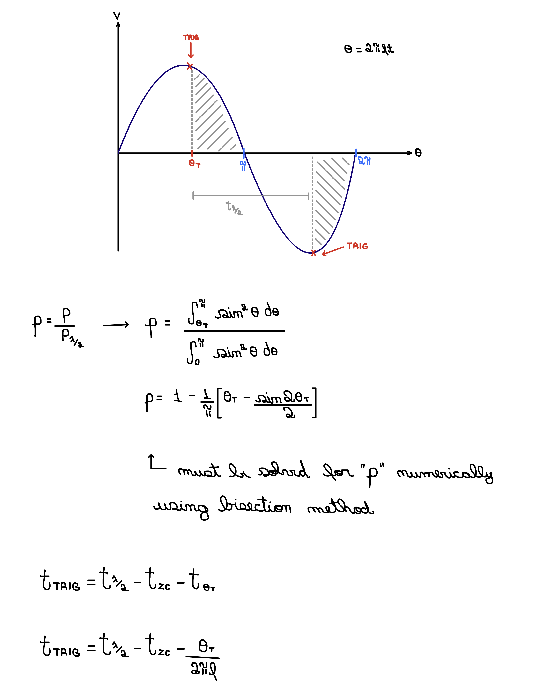

# Dimmer ITC

Phase Angle Control for AC Loads.

## Features

- Non-blocking
- Linear control
- Continuous frequency measurement
- Self-calibrating zero-cross detection

## Functionality

### Linear Output

The output RMS power is linearized by calculating the TRIAC activation angle numerically every time a new power level is requested. This allows for a more flexible and granular control range.

### Zero-Cross Calibration

This library provides a method to calibrate the zero-cross detection circuit. The calibration provides a better full-range control by calculating the amount of time the opto-coupler takes to activate after the zero-crossing event.

## Notes 

- Example code is currently not available but all methods and parameters have briefs.

- It is known to work with ESP8266 microcontrollers (ESP32 support in progress). If you can successfully use a different one, please let me know!
